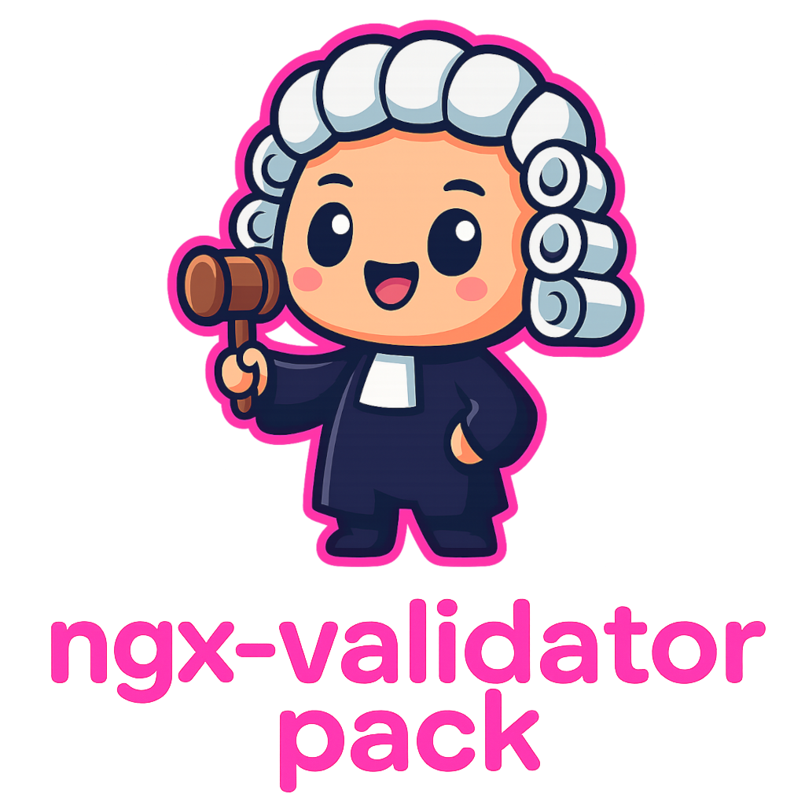

[](https://www.npmjs.com/package/@omnidyon/ngx-validator-pack)
[](https://opensource.org/licenses/MIT)

[](https://www.npmjs.com/package/@omnidyon/ngx-validator-pack)
[](https://github.com/omnidyon/ngx-validator-pack)

<p align="center">
  
  <br>
  <em>Ngx Validator Pack is a collection of validators designed 
    <br> to simplify usage and allow quick customization.</em>
  <br>
</p>

<p align="center">
  <a name="start"></a>
  <a href="CONTRIBUTING.md">Contributing Guidelines</a>
  ·
  <a href="https://github.com/dynimorius/ngx-validator-pack/issues">Submit an Issue</a>
    ·
  <a href="./projects/ngx-validator-pack/README.md">Documentation</a>
</p>

### Live Demo

Explore live usage examples and code previews:  
**[View Demo](https://omnidyon.com/tools/ngx-validator-pack)**

Found this useful? [Star the repo](https://github.com/omnidyon/ngx-validator-pack)  
Want help integrating it into your app? [Book a consult](https://cal.com/omnidyon)

## Documentation

### Full library documentation

If you need help on using Ngx Validator Pack please refer to the provided <a href="./projects/ngx-validator-pack/README.md">documentation</a>.

## Contributing

### Contributing Guidelines

Read through our [contributing guidelines][contributing] to learn about our submission process, coding rules, and more.

### Code of Conduct

Please read and follow our [Code of Conduct][codeofconduct].

## Development

### Development Setup

1. Fork the repo - see full <a href="https://docs.github.com/en/pull-requests/collaborating-with-pull-requests/working-with-forks/fork-a-repo">guide</a>.

2. Clone the repo - see full <a href="https://docs.github.com/en/pull-requests/collaborating-with-pull-requests/working-with-forks/fork-a-repo#cloning-your-forked-repository">guide</a>.

3. Go to the root of the library and install dependencies.

```bash
npm install
```

4. Run library in watch mode

```bash
npm run watch
```

5. Run the examples project

```bash
npm start
```

[contributing]: CONTRIBUTING.md
[codeofconduct]: CODE_OF_CONDUCT.md
[documentation]: ./projects/ngx-validator-pack/README.md
